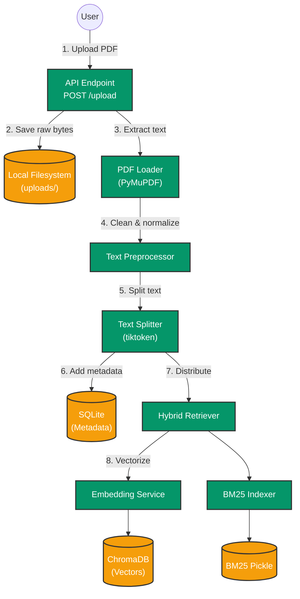
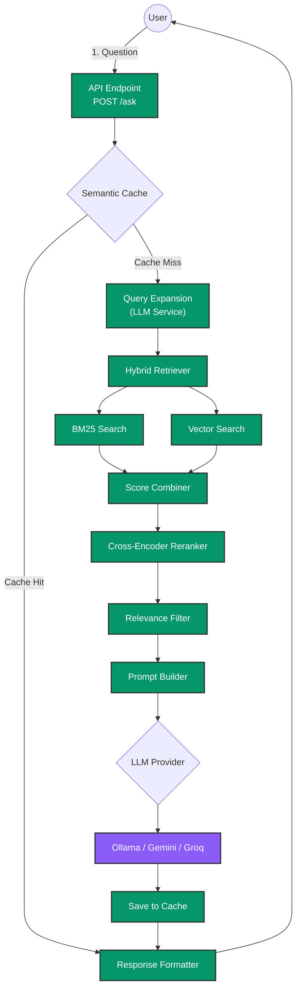

# Retriv 🧠

Retriv is a highly advanced, full-stack Retrieval-Augmented Generation (RAG) application. It allows users to upload PDF documents, intelligently chunk and embed the text, and perform highly accurate Question & Answering over the documents using a True Hybrid Search (BM25 + ChromaDB Vectors) followed by a Cross-Encoder Reranking process.

## 🌟 Unique Selling Proposition (USP)
Retriv differentiates itself by achieving **production-grade retrieval accuracy and lightning-fast inference** even on consumer hardware through:
- **True Hybrid Retrieval:** Combines Lexical BM25 and Semantic Vector Search (unlike standard apps that rely purely on basic vector search).
- **Zero Hallucinations:** Employs a powerful Cross-Encoder Reranker to virtually eliminate AI hallucinations.
- **Lightning Speed:** Uses Semantic Caching to deliver near-instant response times for repeated queries.
- **Complete Flexibility:** 100% LLM-agnostic design, capable of running entirely locally or via cloud providers.

## 🚀 Key Features

- **True Hybrid Retrieval:** Combines keyword search (BM25) and semantic search (ChromaDB + SentenceTransformers).
- **Cross-Encoder Reranking:** Ensures maximum precision by rescoring query/document pairs before sending them to the LLM.
- **Semantic Caching:** Caches previous LLM responses using semantic similarity in ChromaDB to achieve near-instant latency on repeated or similarly phrased questions.
- **LLM Agnostic:** Supports local inference via Ollama, or cloud inference via Groq, Google Gemini, and OpenRouter.
- **Streaming Responses:** Provides real-time streaming of LLM tokens via Server-Sent Events (SSE).
- **Query Expansion:** Automatically expands user queries into 2-3 variations to maximize document recall.
- **Smart Text Chunking:** Preserves semantic meaning using regex boundary protection for academic abbreviations and decimals.

---

## 🏗️ System Architecture

### Document Ingestion Flow


### Question Answering Flow


---

## 💻 Tech Stack

- **Frontend:** React, Tailwind CSS
- **Backend:** FastAPI (Python), PyMuPDF, TikToken, Pydantic
- **Machine Learning:** SentenceTransformers (`BAAI/bge-small-en-v1.5`), CrossEncoder (`ms-marco-MiniLM-L-6-v2`)
- **Databases:** ChromaDB (Vector DB), SQLite (Relational Metadata), `rank_bm25` (Keyword Index)

---

## 🛠️ Step-by-Step Installation Guide

Follow these instructions to run the project locally on your machine.

### Prerequisites
Make sure you have the following installed on your device:
- **Python 3.9+** (For the FastAPI Backend)
- **Node.js v16+ & npm** (For the React Frontend)
- **Git** (To clone the repository)

### 1. Clone the Repository
Open your terminal and clone the repository:
```bash
git clone https://github.com/RahulAdyaa/Retriv.git
cd Retriv
```

### 2. Backend Setup (FastAPI)

The backend handles PDF parsing, vector embeddings, and LLM communication.

1. **Navigate to the backend directory:**
   ```bash
   cd research-rag/backend
   ```

2. **Create and activate a Python Virtual Environment:**
   ```bash
   # On macOS/Linux:
   python3 -m venv venv
   source venv/bin/activate
   
   # On Windows:
   python -m venv venv
   venv\Scripts\activate
   ```

3. **Install the required Python dependencies:**
   ```bash
   pip install -r requirements.txt
   ```

4. **Set up your Environment Variables:**
   Create a new file named `.ENV` in the `backend/` folder and configure your preferred LLM provider. Here is the template:
   ```env
   # Choose one: ollama | gemini | groq | openrouter
   LLM_PROVIDER=ollama 
   
   # If using Ollama (Local):
   OLLAMA_URL=http://localhost:11434
   OLLAMA_MODEL=qwen3:8b

   # If using Google Gemini:
   GEMINI_API_KEY=your_gemini_api_key_here
   GEMINI_MODEL=gemini-1.5-flash-latest

   # If using Groq:
   GROQ_API_KEY=your_groq_api_key_here
   GROQ_MODEL=mixtral-8x7b-32768

   # Local Models (No API Key needed)
   EMBEDDING_MODEL=BAAI/bge-small-en-v1.5
   RERANKER_MODEL=cross-encoder/ms-marco-MiniLM-L-6-v2
   ```

5. **Run the Backend Server:**
   ```bash
   uvicorn app.main:app --reload --host 0.0.0.0 --port 8000
   ```

   ```bash
   cd backend
   source venv/bin/activate
   
   ./start.sh

   ```
   *The backend will now be running at `http://localhost:8000`.*

### 3. Frontend Setup (React)

The frontend provides the Chat UI and PDF upload interface.

1. **Open a new terminal window** (leave the backend running) and navigate to the frontend directory:
   ```bash
   cd research-rag/frontend
   ```

2. **Install Node modules:**
   ```bash
   npm install
   ```

3. **Start the Frontend Development Server:**
   ```bash
   npm start
   ```
   *The React app will automatically open in your browser at `http://localhost:3000`.*

---

## 🎯 How to Use the App

1. **Upload a Document:** Click on the "Upload PDF" button in the sidebar and select a document from your computer.
2. **Wait for Processing:** The backend will extract the text, chunk it into sentences, generate vector embeddings, and store them in ChromaDB.
3. **Ask Questions:** Once the upload is successful, type a question in the chatbox. The hybrid retrieval engine will scan your document and the LLM will generate a context-aware answer!
