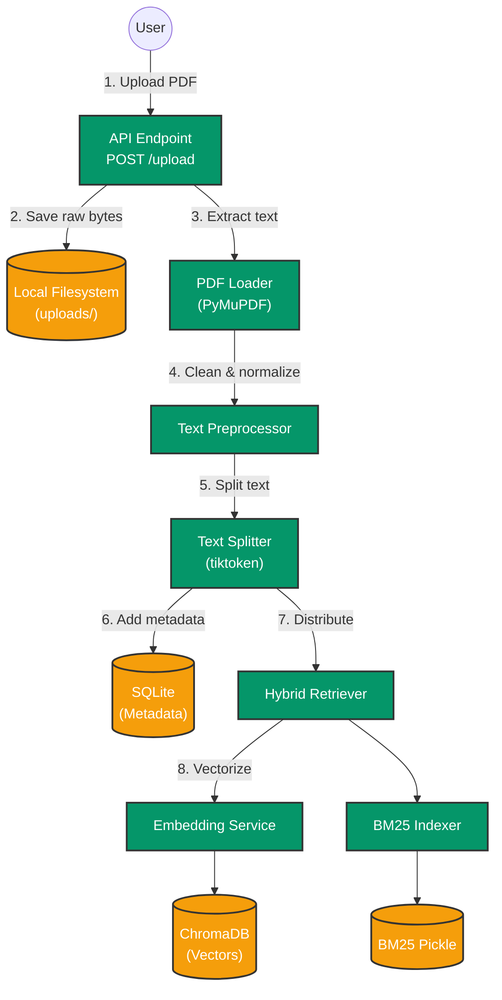
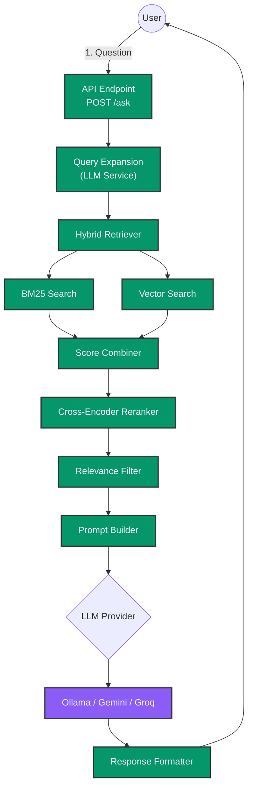

# Nexus-RAG

Nexus-RAG is a highly advanced, full-stack Retrieval-Augmented Generation (RAG) application. It allows users to upload PDF documents, intelligently chunk and embed the text, and perform highly accurate Question & Answering over the documents using a Hybrid Search (BM25 + ChromaDB Vectors) followed by a Cross-Encoder Reranking process.

## 🚀 Key Features

- **True Hybrid Retrieval:** Combines keyword search (BM25) and semantic search (ChromaDB + SentenceTransformers).
- **Cross-Encoder Reranking:** Ensures maximum precision by rescoring query/document pairs before sending them to the LLM.
- **LLM Agnostic:** Supports local inference via Ollama, or cloud inference via Groq, Google Gemini, and OpenRouter.
- **Streaming Responses:** Provides real-time streaming of LLM tokens via Server-Sent Events (SSE).
- **Query Expansion:** Automatically expands user queries into 2-3 variations to maximize document recall.
- **Smart Text Chunking:** Preserves semantic meaning using regex boundary protection for academic abbreviations and decimals.

## 🏗️ System Architecture

### Document Ingestion Flow


### Question Answering Flow


## 🛠️ Tech Stack

- **Frontend:** React, Tailwind CSS
- **Backend:** FastAPI (Python), PyMuPDF, TikToken
- **Machine Learning:** SentenceTransformers (BAAI/bge-small-en for embeddings), CrossEncoder for reranking
- **Databases:** ChromaDB (Vector), SQLite (Relational), rank_bm25 (Keyword)
- **Deployment:** Vercel (Frontend), Render/Railway (Backend API)

## ⚙️ Local Setup

### 1. Backend Setup
Navigate to the `backend/` directory:
```bash
cd backend
python -m venv venv
source venv/bin/activate
pip install -r requirements.txt
```

Create a `.ENV` file in the `backend/` directory with the necessary keys (DO NOT commit this file to GitHub):
```env
# Example .ENV
LLM_PROVIDER=gemini # ollama | gemini | groq | openrouter
GEMINI_API_KEY=your_key_here
GEMINI_MODEL=gemini-1.5-pro

GROQ_API_KEY=your_key_here
GROQ_MODEL=llama3-70b-8192

OLLAMA_URL=http://localhost:11434
OLLAMA_MODEL=llama3

EMBEDDING_MODEL=BAAI/bge-small-en-v1.5
RERANKER_MODEL=cross-encoder/ms-marco-MiniLM-L-6-v2
```

Start the backend server:
```bash
uvicorn app.main:app --reload --host 0.0.0.0 --port 8000
```

### 2. Frontend Setup
Navigate to the `frontend/` directory:
```bash
cd frontend
npm install
npm start
```
The React app will proxy requests to the FastAPI backend running on port 8000.
