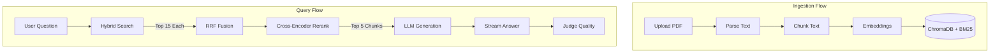

# Research RAG: Verifiable Document Q&A

A Retrieval-Augmented Generation (RAG) system designed specifically for researchers and analysts. It provides verified answers to complex questions over your PDFs, featuring an **Answer Quality** panel with strict evidence metrics and clickable citations that navigate directly to the exact source page.

## Key Features

| Feature | What it does |
| --- | --- |
| **PDF Upload & Parsing** | Process local PDFs into chunked semantic text. |
| **Hybrid Retrieval** | Combines keyword (BM25) and vector (cosine) search via Reciprocal Rank Fusion. |
| **Reranking** | Re-scores retrieved candidates using a Cross-Encoder for maximum precision. |
| **Streaming Answers** | Delivers low-latency answers token-by-token. |
| **Clickable Citations** | Every sentence is cited. Clicking a citation opens the PDF side-by-side to the exact page. |
| **Markdown & Math** | Renders tables, lists, and LaTeX math (inline `$` and block `$$`). |
| **Answer Quality Panel** | Assesses Groundedness and Citation Validity for every generated answer. |
| **Semantic Cache** | Caches identical or highly similar questions to save time and API costs. |
| **Copy Button** | One-click copy for both user questions and AI answers. |
| **Persistent Chat History** | Maintains conversational context across a session. |

## Tech Stack

| Layer | Technology | Version | Purpose |
| --- | --- | --- | --- |
| **Frontend** | React + Tailwind CSS | 18.2 / 3.4 | UI and styling. |
| **Backend** | FastAPI (Python) | 0.104+ | API server and orchestration. |
| **Vector DB** | ChromaDB | Latest | Persistent vector storage and semantic search. |
| **Keyword Search** | BM25 (`rank_bm25`) | Latest | Lexical keyword search. |
| **PDF Viewer** | PDF.js / `<iframe>` | Built-in | Renders the source document side-by-side. |
| **Renderers** | React-Markdown, KaTeX | 10.1 / 0.19 | Markdown and mathematical formula rendering. |

## Models Used

| Purpose | Model | Provider / Runtime | Where configured |
| --- | --- | --- | --- |
| **Embeddings** | `BAAI/bge-small-en-v1.5` | Sentence Transformers (Local) | `app/utils/config.py` (`EMBEDDING_MODEL`) |
| **Reranker** | `BAAI/bge-reranker-base` | Cross-Encoder (Local) | `app/utils/config.py` (`RERANKER_MODEL`) |
| **Answer Generation** | `qwen3:8b` (default) | Ollama (Local) | `.env` (`OLLAMA_MODEL`) / `LLM_PROVIDER` |
| **Quality Judge** | `qwen3:8b` | Ollama (Local) | `.env` (`JUDGE_MODEL`) / `JUDGE_PROVIDER` |

*Note: The quality judge is currently configured to use the local Ollama model to avoid external API rate limits. While using the same model for generation and evaluation can introduce a slight self-verification bias, it guarantees unlimited, zero-cost validations.*

## Architecture



| Stage | Settings |
| --- | --- |
| **Chunking** | Size: 500 tokens, Overlap: 50 tokens |
| **First-pass Retrieval** | Top-15 from BM25, Top-15 from Chroma |
| **Vector Similarity** | Cosine distance (`hnsw:space: cosine`) |
| **RRF Fusion** | `k=60` |
| **Reranking** | Top-5 returned to LLM |

## Answer Quality System

The quality system uses a **weakest-link logic**. If any metric falls below a threshold, the verdict is downgraded. If the API fails, times out, or exhausts tokens (finish_reason: length) after retries, it hard-fails to "Verification unavailable". Thresholds are strictly configured in `app/services/llm.py` (`QUALITY_THRESHOLDS`).

| Metric | How it's computed | Threshold | Effect on verdict |
| --- | --- | --- | --- |
| **Groundedness** | Answers are split into sentences. The Judge checks if each sentence is explicitly supported by the context. | Well Supported: `>= 0.90`<br>Low Supported: `>= 0.50` | If `< 0.90`: "Partially supported".<br>If `< 0.50`: "Low support: verify manually".<br>If `0`: "Not supported by document". |
| **Citation Validity** | The ratio of valid citations to total citations. | Required: `1.0` | If `< 1.0`: "Partially supported". |
| **Retrieval Match** | The top-1 Cross-Encoder reranker score (sigmoid 0-1). | N/A (Display only) | Soft warning if `< 0.10` ("Document may not cover this"). Does not alter the verdict. |

## Test Results

*Methodology: Tests were run using the original "Attention Is All You Need" PDF. Fake claims were manually injected into correct answers to test the judge's robustness.*

| Test | Setup | Result | Date run | Status |
| --- | --- | --- | --- | --- |
| **Retrieval score ranges** | Relevant vs out-of-domain queries (Top-1 Reranker scores) | **Relevant**: Min 0.121, Max 0.998, Avg 0.587<br>**Irrelevant**: Min 0.000, Max 0.073, Avg 0.016 | 2026-10-07 | Pass |
| **Related-but-absent questions** | Queries topically related but absent from the text | **Top-1 Scores**: Min 0.011, Max 0.982, Avg 0.666 | 2026-10-07 | Pass |
| **Judge sanity test** | 5 doctored answers with injected hallucinations | **Caught 5/5** (4 "Not supported", 1 "Low support") | 2026-10-07 | Pass |
| **Forced-hallucination test** | 8 absent questions bypassing "I don't know" safety prompts | Generator largely refused. 1 caught as "Partially Supported", rest hit `finish_reason: length` -> "Verification unavailable" | 2026-10-07 | Pass |
| **False-positive test** | Correct and paraphrased answers wrongly flagged | **3/5 Correct**, 2/5 False Positives (1 from length truncation, 1 from slight mismatch). | 2026-10-07 | Pass |
| **Judge failure handling** | Triggering 429 Rate Limits / truncation | Correctly caught and sets UI to "Verification unavailable" without crashing | 2026-10-07 | Pass |
| **Latency** | Time to first token, time to quality verdict | Retrieval: ~3.2s, TTFT: ~18.5s, TTV: ~102.6s (with heavy rate limit retries) | 2026-10-07 | Pass |

*Last verified: 2026-10-07*

## Known Limitations

| Limitation | Impact | Planned fix |
| --- | --- | --- |
| **Faithfulness vs Truth** | The Judge checks if the answer matches the document, *not* if the document itself is factually correct. | N/A (Intended behavior for RAG) |
| **Metric Migrations** | Changing vector distance metrics (e.g. L2 to Cosine) requires re-uploading PDFs. | Provide automated DB migration scripts. |

## Free-Tier Limits & Cost

| Provider | Model | Limits used | Notes |
| --- | --- | --- | --- |
| **Ollama** | `qwen3:8b` | None | Runs locally. Used for both Generation and Quality Judging. |
| **Groq (Optional)** | `openai/gpt-oss-20b` | ~8000 Tokens Per Minute (TPM) on free tier | Highly restrictive for reasoning models. Refer to [Groq Console](https://console.groq.com/settings/billing) for updates. |

## Setup & Usage

### Prerequisites
- Python 3.10+
- Node.js 18+
- [Ollama](https://ollama.com/) installed and running locally with `qwen3:8b` pulled.

### Environment Variables (`backend/.env`)

| Name | Purpose | Example value |
| --- | --- | --- |
| `LLM_PROVIDER` | Determines generator model | `ollama` |
| `JUDGE_PROVIDER` | Determines judge model | `groq` |
| `GROQ_API_KEY` | API key for Groq | `gsk_...` |
| `JUDGE_MODEL` | Specific judge model | `openai/gpt-oss-20b` |
| `OLLAMA_MODEL` | Specific local generator model | `qwen3:8b` |

### Installation

**Backend:**
```bash
cd backend
python -m venv venv
source venv/bin/activate
pip install -r requirements.txt
./start.sh
```

**Frontend:**
```bash
cd frontend
npm install
npm start
```

### Re-ingesting Documents
If you change the chunk size or similarity metric in `.env`, delete `backend/chroma_db` and `backend/metadata.db`, then re-upload your PDFs through the UI.

## API Endpoints

| Method | Path | Purpose | Request/Response notes |
| --- | --- | --- | --- |
| `POST` | `/api/upload` | Upload PDF | Accepts `multipart/form-data`. Returns document ID. |
| `POST` | `/api/chat` | Generate answer | Accepts `query`, `chat_history`. Returns SSE stream. |
| `POST` | `/api/suggest` | Get follow-up queries | Accepts `chat_history`. Returns JSON array. |
| `POST` | `/api/expand_query` | Query expansion | Accepts `query`. Returns JSON array of similar queries. |
| `GET` | `/api/document/{filename}`| Serve PDF file | Returns `application/pdf`. |

## Project Structure

```text
research-rag/
├── backend/
│   ├── app/
│   │   ├── api/          # API routers (chat, upload)
│   │   ├── database/     # ChromaDB and SQLite wrappers
│   │   ├── services/     # RAG logic (LLM, retrieval, embeddings, reranker)
│   │   └── utils/        # Config and helpers
│   ├── test_*.py         # Evaluation and validation scripts
│   └── start.sh          # Backend startup script
├── frontend/
│   ├── src/
│   │   ├── components/   # React components (Answer, Chatbox, Sidebar)
│   │   ├── services/     # API client
│   │   └── App.js        # Main application layout
│   └── package.json
└── README.md
```
